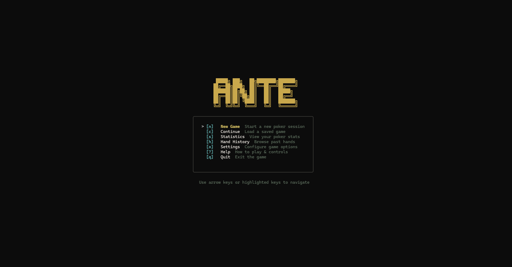
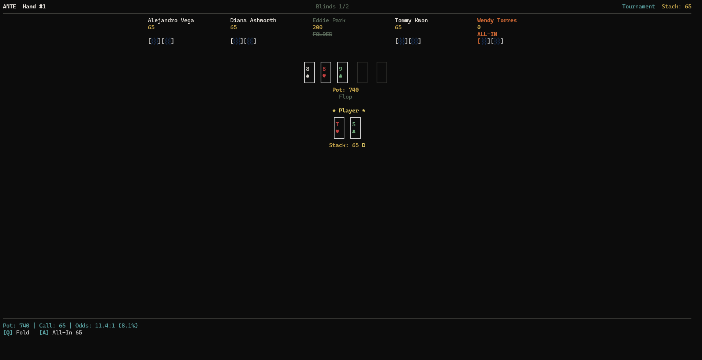

# Ante

[](https://github.com/fabiomigueldp/ante/actions/workflows/ci.yml)
[](https://go.dev/)
[](LICENSE)

Ante is a terminal-based Texas Hold'em poker game built entirely in Go. It features a custom poker engine, AI opponents with distinct personalities, procedurally generated sound effects, and a polished TUI powered by [Bubble Tea](https://github.com/charmbracelet/bubbletea).

## Screenshots

### Main Menu


### Gameplay


## Overview

Ante aims to deliver a complete, engaging poker experience without ever leaving your terminal. Start a tournament, sit down at a cash game table, or challenge a single opponent heads-up. Every session pits you against AI players drawn from a cast of 18 characters, each with a unique profile that shapes how they bet, bluff, and react under pressure.

The project is under active development. The core engine and TUI are mature and stable, but some features visible in menus are still being implemented. See the [Development Status](#development-status) section below for details on what is fully functional today and what is planned.

## Features

### Working and Stable

- **Core Poker Engine** -- Full Texas Hold'em rules implementation including betting rounds, pot and side-pot calculation, showdowns with proper hand evaluation and ranking, and dealer rotation. The engine is stress-tested through the included simulation runner.
- **Three Game Modes** -- Tournament (Sit & Go) with escalating blinds, Cash Game with fixed blinds, and Heads-Up Duel (one-on-one tournament). All three modes are playable from New Game through to completion.
- **18 AI Opponents** -- Characters spanning four skill tiers (Beginner, Intermediate, Advanced, Expert) and nine play styles (Nit, TAG, LAG, Calling Station, Maniac, Trappy, Hero Caller, Balanced, Straightforward). Each bot has a unique name, nickname, personality flavor, and a parametric profile that drives decision-making.
- **Bot Personality System** -- Bots consider hand strength, draw potential, pot odds, table pressure, and their individual aggression, bluff frequency, call-down tendency, and tilt reactivity to choose actions. They generate a reasoning string for each decision and simulate variable think times.
- **Polished TUI** -- Splash screen, main menu, game setup, in-game table view, pause menu, results screen, settings editor, and help screen. The interface adapts to terminal size (minimum 80x24) and uses styled card rendering, status indicators, dealer badges, pot odds display, and color-coded action prompts.
- **Procedural Audio** -- Synthesized sound effects for chip actions, card dealing, showdowns, all-ins, blind increases, victories, defeats, and more. Volume and mute are configurable. Audio is generated procedurally at runtime with no external asset files required. A native audio backend is available on supported platforms, with a graceful no-op fallback elsewhere.
- **Tournament Mechanics** -- Configurable blind structure with timed level increases, player elimination tracking with positional ranking, and automatic heads-up transition detection.
- **Pot Odds Display** -- When facing a bet, the action bar shows pot size, call cost, odds ratio, and equity percentage to help inform decisions.
- **In-Memory Hand History** -- Every hand played in a session is recorded with full action sequences, board cards, player snapshots, blinds, and seeds via the `SessionHistory` system.
- **Configuration Persistence** -- Player name, sound settings, pot odds toggle, default game mode, difficulty, seat count, starting stack, and theme preference are saved locally as JSON and restored automatically on launch.
- **Engine Simulator** -- A standalone simulation runner (`cmd/sim`) exercises the engine over thousands of hands to verify correctness and stability without involving the TUI.
- **Continuous Integration** -- GitHub Actions runs tests, verifies module graph integrity, and builds binaries for both Linux and Windows (with native audio) on every push and pull request.

### Partially Implemented

The following features have scaffolding, UI screens, or backend primitives in place, but are not yet fully connected end-to-end. They are listed here for transparency and are actively tracked in the [development roadmap](ROADMAP.md).

- **Save / Load / Continue** -- The storage layer can serialize and deserialize game slots, and the Load Game screen lists saved slots. However, the save action in the pause menu and the load action on slot selection are not yet wired to real persistence and session reconstruction. Today only the New Game flow is functional.
- **Statistics Persistence** -- The `StatsStore` and `SessionStats` types exist along with `SaveStats()` and `LoadStats()` functions. The Statistics screen reads persisted data. However, statistics are not yet automatically recorded at the end of every session, so the store may remain empty unless manually populated.
- **Hand History Browser** -- The "Hand History" menu entry shows a list of past sessions (not individual hands), and the "View Details" action on a selected entry is not yet connected. Hand-level browsing and per-hand replay are planned but not implemented.
- **Hand Replay** -- A `ReplayModel` exists and can step through actions if provided a valid `HandRecord`, but the wiring from the history browser to the replay screen is incomplete. Board card progression during replay uses a simplified heuristic rather than faithful street-by-street reconstruction.

## Project Structure

```
cmd/
  ante/        Main TUI application entrypoint
  sim/         Engine simulation and stress-test runner

internal/
  engine/      Core poker rules, betting, pot mechanics, showdowns,
               hand evaluation, tournament logic, cash game support,
               table management, and hand history recording
  ai/          Bot decision engine, character profiles, hand strength
               and draw estimation, tilt modeling, and skill tiers
  session/     Orchestration layer connecting engine, AI, and TUI;
               manages the game loop, event emission, and state snapshots
  tui/         All Bubble Tea views: splash, menu, setup, game table,
               pause, results, stats, history, replay, settings, help,
               load game, theme, and card rendering utilities
  storage/     Local persistence for configuration, save slots,
               and player statistics
  audio/       Procedural sound synthesis, playback management,
               native and no-op backends, and cooldown logic
```

## Requirements

- Go 1.26 or newer

## Quick Start

Run the TUI application directly:

```bash
go run ./cmd/ante
```

Run the engine simulator (for example, 1000 hands):

```bash
go run ./cmd/sim -hands 1000
```

## Build

Compile the TUI application:

```bash
go build -o ./bin/ante ./cmd/ante
```

Compile with native audio support (Windows):

```bash
go build -tags nativeaudio -o ./bin/ante ./cmd/ante
```

Compile the simulator:

```bash
go build -o ./bin/sim ./cmd/sim
```

Or use the Makefile:

```bash
make build        # Build the TUI binary
make build-sim    # Build the simulator binary
make run          # Run the TUI directly
make test         # Run the full test suite
make sim          # Run a 1000-hand simulation
```

## Controls

### In-Game

| Key       | Action                                    |
|-----------|-------------------------------------------|
| `Q`       | Fold                                      |
| `W`       | Check                                     |
| `E`       | Call                                       |
| `T`       | Raise / Bet (enters amount input mode)    |
| `A`       | All-In                                    |
| `0-9`     | Enter a specific bet amount               |
| `Enter`   | Confirm bet amount                        |
| `Esc`     | Open pause menu                           |

### Navigation

| Key          | Action                            |
|--------------|-----------------------------------|
| `Up` / `Down`  | Navigate menu items             |
| `Left` / `Right` | Adjust values in setup/settings |
| `Enter`      | Select or confirm                 |
| `Esc`        | Go back to previous screen        |

### Pause Menu

| Key  | Action           |
|------|------------------|
| `Esc`| Resume game      |
| `H`  | Open help screen |
| `Q`  | Quit to menu     |

## Configuration

Ante stores user configuration at `~/.ante/config.json`. All settings are editable from the in-game Settings screen and persist across sessions. Configurable options include:

- Player name
- Sound on/off and volume level
- Pot odds display toggle
- Animation speed
- Default game mode, difficulty, seat count, and starting stack
- Theme selection

## Development Status

Ante has a strong core and a polished interface. The engine handles proper Hold'em mechanics, the TUI provides a complete visual experience, and the AI opponents are functional and differentiated. The following areas represent the main gaps between the current state and a fully complete product. Each item is documented in detail in [ROADMAP.md](ROADMAP.md).

| Area                     | Status                                                         |
|--------------------------|----------------------------------------------------------------|
| New Game flow            | Fully functional                                               |
| Core engine              | Stable, stress-tested                                          |
| AI decision-making       | Functional, personality-driven                                 |
| TUI / interface          | Mature and polished                                            |
| Audio                    | Working, procedurally generated                                |
| Configuration            | Persistent, editable                                           |
| Save / Load              | Scaffolded, not wired                                          |
| Statistics               | Backend exists, session integration pending                    |
| Hand History browser     | Session-level list only                                        |
| Hand Replay              | Model exists, wiring incomplete                                |
| Cash Game continuity     | Plays to completion, not yet a true open-ended table           |
| Tournament UX depth      | Functional, progression HUD planned                            |
| AI strategic depth       | Several profile parameters are defined but not yet leveraged   |

## Testing

Run the full test suite:

```bash
go test ./... -count=1
```

The project includes unit and integration tests across the engine, session, AI, TUI, and audio layers. GitHub Actions runs these checks on every push and pull request.

## Contributing

See [CONTRIBUTING.md](CONTRIBUTING.md) for development setup and guidelines.

## License

This project is licensed under the MIT License. See [LICENSE](LICENSE) for details.
